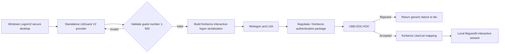

# Standalone LibGuest Credential Provider for Entra-Only Devices

> [!warning] Status: concept and security-reviewed proof of concept only
> A credential provider runs on the Windows secure desktop and handles plaintext
> credentials at the logon boundary. A defect can prevent users and administrators
> from signing in. Build and test only on a disposable, snapshotted VM until the
> recovery and kill-switch design has been proven.

## Objective

Provide a dedicated **UMD Library Guest** tile on an Entra-only Windows lock screen.
The tile accepts a SIMS-issued `libguestN` credential, serializes it for the Windows
Kerberos/Negotiate authentication path, and allows the existing Kerberos `UserList`
mapping to place the patron into the corresponding local `libguestN` profile.

Unlike the session-broker approach, this is intended to create a true Windows
interactive logon where the patron owns the session, shell, profile, and application
processes.

## Why this approach exists

The existing tests establish the following:

- External UMD Kerberos realm discovery works on the Entra-only device.
- The device can reach the `UMD.EDU` KDCs.
- The Kerberos `UserList` registry mapping works outside LogonUI.
- `runas /user:libguestN@UMD.EDU cmd.exe` succeeds with a live SIMS password.
- The standard Entra lock screen claims the `@umd.edu` UPN and routes it to Entra,
  where the MIT-only `libguestN` identity does not exist.

The remaining hypothesis is that a standalone credential provider can supply a
Kerberos interactive-logon serialization without allowing CloudAP's typed-UPN
discovery to claim the credential first. The `runas` result makes this plausible;
it does not prove that LogonUI will accept the proposed serialization. The first
milestone must test that exact boundary.

## Use a standalone V2 provider

Do not wrap or replace Microsoft's password provider. Microsoft recommends a
standalone custom provider because wrappers depend on system-provider behavior and
can break as Windows changes. Microsoft also recommends implementing
`ICredentialProviderCredential2` for a V2 provider.

Reference: [Credential providers in Windows](https://learn.microsoft.com/windows/win32/secauthn/credential-providers-in-windows)

The built-in password, Windows Hello, and recovery-capable system providers must
remain available. The LibGuest provider is an additional tile, not an enforcement
filter.

## Proposed user experience

The secure-desktop tile should contain:

- UMD Libraries branding
- Title: **Library Guest Sign-In**
- Guest number field accepting `1` through `500` or `libguestN`
- Password field
- A short note that credentials are issued by library staff
- A sign-in button
- Generic failure text that does not distinguish an unknown account from a bad
  password

The provider constructs the principal internally. Patrons should not type a realm,
domain, or arbitrary username.

## Proposed architecture



### Provider responsibilities

- Implement `ICredentialProvider`.
- Implement `ICredentialProviderCredential`.
- Implement `ICredentialProviderCredential2` for the V2 design.
- Support `CPUS_LOGON` first.
- Add and test unlock behavior explicitly; modern Windows often combines logon and
  unlock flows, but the provider must respond safely to the scenario Windows sends.
- Return not-implemented or no credentials for scenarios that are intentionally not
  supported, such as password change, PLAP, or CredUI during the initial prototype.
- Look up the authentication package rather than hardcoding its numeric identifier.
- Package a correct Kerberos interactive-logon buffer for Winlogon.
- Return the provider's own CLSID in the serialization structure.
- Clear password fields and buffers immediately after serialization.
- Never call the KDC directly and never call `LsaLogonUser` from the provider;
  Winlogon and LSA own authentication.

Reference: [Credential serialization structure](https://learn.microsoft.com/windows/win32/api/credentialprovider/ns-credentialprovider-credential_provider_credential_serialization)

## Security boundaries

- Accept only account numbers `1` through `500`.
- Hardcode or securely configure the allowed realm as `UMD.EDU`; never accept a
  user-supplied realm.
- Do not retain the password after `GetSerialization()` returns.
- Do not log passwords, serialized buffers, or recoverable credentials.
- Avoid crash dumps containing credential buffers; define and test the dump policy.
- Use safe string and buffer-length handling throughout the native C++ code.
- Authenticode-sign the DLL and all deployment scripts.
- Obtain security review from the UMD security team, including CrowdStrike Falcon,
  Rapid7 InsightVM, and WDAC/App Control impact.
- Preserve at least one Microsoft system credential provider for recovery.
- Provision a Windows LAPS-managed local administrator before the pilot.
- Confirm BitLocker recovery escrow before every physical-device test.

## Build plan

### Phase 0 - Fix and validate the account package

Before provider work:

1. Reset the SAM password for every managed `libguestN` account, including accounts
   created by the legacy installer.
2. Validate `libguest.txt` contains exactly `libguest1` through `libguest500`.
3. Write a versioned completion sentinel only after all accounts and mappings
   succeed.
4. Correct detection and uninstall failure handling.
5. Package from a clean staging directory that excludes all legacy files.

### Phase 1 - Build environment

- Visual Studio 2022 or current supported Visual Studio
- Desktop development with C++ workload
- Current Windows SDK matching the test OS
- x64 Release build
- Static analysis and compiler security options enabled
- A unique provider CLSID generated for UMD Libraries
- A code-signing certificate suitable for the test and eventual production trust
  chain

Start from Microsoft's credential-provider sample for interface and lifecycle
patterns, but implement a standalone provider. Do not use the wrapper sample as the
production base.

### Phase 2 - Diagnostic provider

The first provider should do as little as possible:

1. Render a basic tile with guest number and password fields.
2. Validate the guest number locally.
3. Construct the candidate Kerberos interactive-logon serialization.
4. Submit it to Winlogon.
5. Handle success and failure without leaking the password.
6. Leave every built-in provider enabled.

Do not spend time on branding until a live SIMS credential produces a true local
`libguestN` interactive session.

### Phase 3 - Production-quality provider

After authentication succeeds:

- Add UMD Libraries branding and accessible field labels.
- Add sanitized Windows Event Log diagnostics.
- Add robust field clearing after failures and retries.
- Test all relevant usage scenarios and user switching.
- Add localization only if operationally required.
- Add signed installer, uninstaller, and detection scripts.
- Complete threat modeling and security review.

## Registry registration model

Use a unique CLSID. The future installer will write at least:

```text
HKLM\SOFTWARE\Classes\CLSID\{Provider-CLSID}\InprocServer32
HKLM\SOFTWARE\Microsoft\Windows\CurrentVersion\Authentication\Credential Providers\{Provider-CLSID}
```

The `InprocServer32` default value points to the signed DLL in a protected location,
for example:

```text
C:\Program Files\UMD Libraries\LibGuestCredentialProvider\LibGuestCredentialProvider.dll
```

Use `ThreadingModel = Apartment` only if it matches the implemented COM model and
sample guidance. Registration should be explicit and idempotent; do not rely on an
interactive `regsvr32` workflow.

## Intune deployment design

Future clean package layout:

```text
CredentialProvider/
├── Install-LibGuestCredentialProvider.ps1
├── Uninstall-LibGuestCredentialProvider.ps1
├── Detect-LibGuestCredentialProvider.ps1
└── LibGuestCredentialProvider.dll
```

Install behavior: **System**.

The installer should:

1. Verify the DLL's Authenticode signature and expected publisher.
2. Copy it to the protected installation directory.
3. Create the COM CLSID registration.
4. Register the credential provider.
5. Write a versioned application sentinel.
6. Log only deployment state to
   `C:\ProgramData\LibGuestCredentialProvider\install.log`.

The uninstaller/kill switch must:

1. Remove the Credential Providers registration first so future LogonUI instances
   stop loading the DLL.
2. Remove the COM CLSID registration.
3. Remove the DLL only after registration is gone.
4. Return a failure exit code if any security-relevant registration remains.

Use detection that checks the provider registration, installed version, DLL path,
file hash or signature state, and application sentinel. A bare CLSID-exists rule is
not strong enough for production health detection.

## Recovery and kill-switch plan

Before the first physical deployment:

- Create a separate Intune uninstall assignment that can be activated immediately.
- Create an Intune Remediation that detects the provider's kill-switch registry
  value and unregisters the provider.
- Preserve the Microsoft password provider and a LAPS-managed local administrator.
- Document Safe Mode/offline registry removal for deskside support.
- Confirm BitLocker recovery-key access for the support team.
- Maintain a known-good signed previous version for rollback.
- Use a dedicated test device group containing no production public PCs.

Do not use `Credential Provider Filters` to hide built-in providers. The recovery
tile must remain visible even if the LibGuest provider fails.

## Test matrix

Test on a snapshotted Entra-only VM and then one reimageable physical device:

| Area | Tests |
|---|---|
| Authentication | Correct password, incorrect password, expired/reset password, malformed guest number |
| Network | No network, DNS failure, TCP 88 blocked, UDP 88 blocked, slow KDC, network becomes available after boot |
| Session | First logon, repeat logon, lock/unlock, sign-out, switch user, simultaneous signed-in user |
| Provider lifecycle | Install while signed in, sign-out, reboot, upgrade, downgrade, unregister, uninstall |
| Recovery | Built-in provider login, LAPS login, offline registry removal, Intune kill switch |
| Windows servicing | Monthly cumulative update, feature update, driver update, rollback |
| Security | WDAC/App Control, CrowdStrike behavior, Rapid7 findings, DLL tampering, unsigned replacement |
| Privacy | Event logs, crash dumps, memory inspection, password-field clearing |

## Acceptance criteria

- A live SIMS credential creates a true interactive local `libguestN` session.
- The Windows session token, profile, Explorer shell, and child processes all belong
  to the expected mapped local account.
- Incorrect credentials fail without falling through to Entra authentication.
- KDC/network failures return safely to the tile without hanging LogonUI.
- Microsoft recovery providers remain available at all times.
- No password or serialized credential appears in logs, dumps, command lines, or
  persistent storage.
- The signed uninstall/kill switch reliably disables the provider.
- Security approves the design and operational ownership.

## Decision summary

This is the only proposed approach that preserves the current SIMS/Kerberos workflow
and gives the patron a normal Windows desktop session on an Entra-only device.

It is also the highest-risk approach because the DLL is loaded by LogonUI on the
secure desktop. Treat the initial implementation as a narrow authentication
experiment. Proceed to deployment engineering only after the serialization premise
works on a snapshotted VM and the recovery path has been demonstrated.
